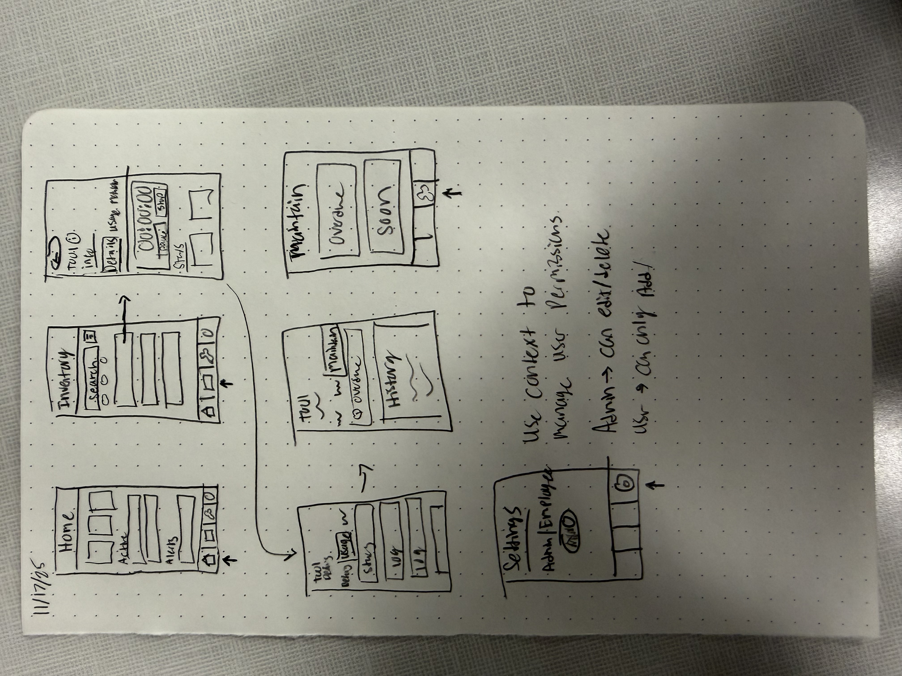

# Maintenance Tracker (yet to be named)

Maintenance Tracker is created to fill the gap between the manual labor and mechanical maintenance world. Tracking the maintenance of your equipment can be a timely and forgotten task, leading to equipment being down when it is needed or equipment not ready to be used at the start of a job, all of which cost the company money. Maintenance Tracker provides an easy way to log tool usage and view upcoming/preventative maintenance to be sure your equipment is not out of service when you need it most.

# Wireframe

# HIG

### Dark Mode

A specific HIG feature I wanted to implement from the start was dark mode.
A few specific features of dark mode HIG were sought after and are as follows:

- Avoid offering an app-specific appearance setting.
- Test your content to make sure that it remains comfortably legible in both appearance modes.
- Aim for sufficient color contrast in all appearances.

### SF Symbols

An itentional HIG design choice I wanted to follow is the use of SF Symbols for the devices running my app on iOS. The main reason is to use something familiar and clean. The symbols automatically change depending on the theme of the device. Additionally, there are different rendering modes that can be used to give the application more depth. I have not messed with rendering modes yet but will soon.

# Notes

- Remove src folder
- Fix expo router navigation https://docs.expo.dev/router/basics/common-navigation-patterns/
- Break down globalStyles into reusable components (i.e. Title, SubTitle, Card etc.)
